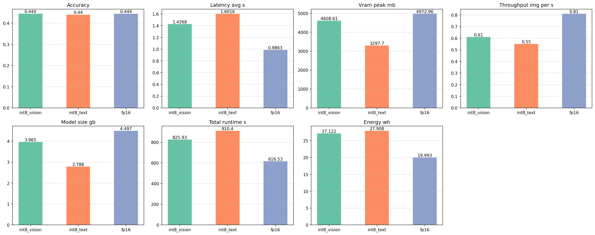

## ICS_Assignment1_Model-Quantization

This repository contains the notebook and the execution reuslts on Google Collab T4 instance. 

## Repository structure

| Path | Purpose |
|---|---|
| [`ICS_Ass1.ipynb`](ICS_Ass1.ipynb) | Jupyter notebook with the experiment pipeline: model loading (FP16 / INT8_TEXT, INT8_VISION), dataset selection, inference, metrics collection, spot-checks, and plotting. |
| [`emissions_fp16.csv`](results/emissions_fp16.csv), [`emissions_int8_text.csv`](results/emissions_int8_text.csv), [`emissions_int8_vision.csv`](results/emissions_int8_vision.csv) | CodeCarbon energy logs produced during each experiment. |
| [`model_structure_fp16.txt`](results/model_structure_fp16.txt), [`model_structure_int8_text.txt`](results/model_structure_int8_text.txt), [`model_structure_int8_vision.txt`](results/model_structure_int8_vision.txt) | Text dumps of the model architecture for each quantization configuration. |
| [`results_fp16.json`](results/results_fp16.json), [`results_int8_text.json`](results/results_int8_text.json), [`results_int8_vision.json`](results/results_int8_vision.json) | Experiment summaries (accuracy, latency, VRAM, throughput, model size, runtime, energy). |
| [`validation_subset_inidices.json`](results/validation_subset_inidices.json) | Saved random subset indices used for the validation runs (reproducibility). |
| [`config.json`](config.json) | Configuration file to set experiment settings (dataset name, model, sample size, quantization options). |
| [`plots/`](results/plots/) | Generated PNG plots (combined and per-metric visualizations). |
| [`spotcheck_results/`](results/spotcheck_results/) | Saved sample images and human spot-check JSONs (e.g., `human_spotcheck_fp16.json`, `human_spotcheck_int8_text.json`). |

## Experiment description

- Used [HuggingFaceTB/SmolVLM-Instruct](https://huggingface.co/HuggingFaceTB/SmolVLM-Instruct) as base model.
- Evaluated on [lmms-lab/textvqa](https://huggingface.co/datasets/lmms-lab/textvqa) dataset
- Quantization strategies implemented in the notebook:
  - `fp16` — baseline using float16 model weights
  - `int8_text` — 8-bit weight-only quantization applied to text-related layers (via bitsandbytes)
  - `int8_vision` — 8-bit quantization targeting the vision tower (vision encoder)

- Metrics collected per experiment include accuracy, average latency, peak VRAM, throughput (images/sec), saved model size on disk, total runtime, and measured energy (Wh).
- The notebook uses Hugging Face Transformers and a model-backed processor (`AutoProcessor`) to prepare multimodal inputs.

## Results
Experiments were conducted using  Figure shows evaluations of different quantization approaches for different metrics for the SmolVLM model.
Quantization approaches:

## Environment

Notebook was executed on Google Collab T4 instance:

| Component | Specification                             |
| --------- | ----------------------------------------- |
| **GPU**   | NVIDIA T4 (16 GB VRAM)                    |
| **CPU**   | 2-core virtual machine (Google Colab Pro) |
| **RAM**   | 12 GB                                     |

## Dependencies
| Library / Component | Version / Detail  |
| ------------------- | ----------------- |
| **Python**          | 3.10              |
| **PyTorch**         | torch 2.3         |
| **Transformers**    | transformers 4.41 |
| **bitsandbytes**    | bitsandbytes 0.43 |
| **CodeCarbon**      | codecarbon 2.3    |
| **CUDA**            | 12.4              |
| **cuDNN**           | 8.9               |
